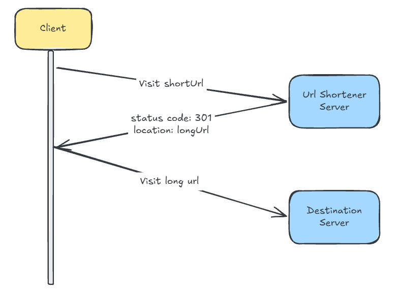
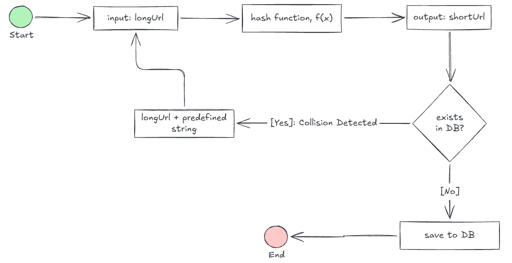
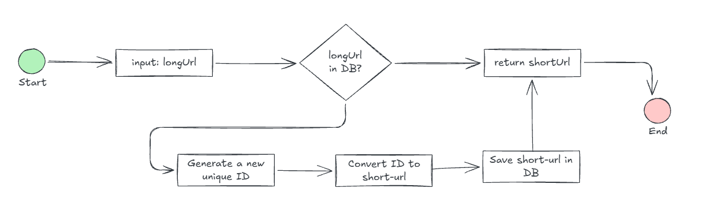

# URL Shortner

In this repository we will be building a URL shortner without the use of an AI agent to write code. The whole purpose of it is to get back in touch with writing code and thinking through any problems we might face, or features we might want to add.
Don't get me wrong, building tools with AI is much faster and some would say is more productive... but what happens to our skillset 10 years from now when all we've been doing is prompt engineering?

## What is a URL Shortener?

A URL shortener is a tool that turns a long, complex website address into a short, simple link that still goes to the exact same page.

Have you ever been browsing a web-page and tried to copy a link and then saw something like this:

- `https://www.google.com/search?q=what+is+a+url+shortener&oq=what+is+a+URL+shortener&gs_lcrp=EgZjaHJvbWUqDQgAEAAYkQIYgAQYigUyDQgAEAAYkQIYgAQYigUyCAgBEAAYFhgeMggIAhAAGBYYHjIICAMQABgWGB4yCAgEEAAYFhgeMggIBRAAGBYYHjIICAYQABgWGB4yCAgHEAAYFhgeMggICBAAGBYYHjIICAkQABgWGB7SAQg1NzE5ajBqN6gCALACAA&sourceid=chrome&source=chrome.ob&ie=UTF-8`

This definitely does not look pretty, and you'd be surprised how many websites contain URL's like this. Part of building a URL shortner is to also understand the problem that is being solved by a URL shortner.

## The Problem

A URL shortnener solves the problem of long, complex, and messy web addresses that are hard to share, remember, or fit into character-limited spaces.

- **Length and Character Limits**: Long links take up too much space on platforms with strict character limits like social media posts or SMS messages.
- **Aesthetic Clutter**: Clunky links with long tracking codes look messy and untrustworthy in emails, print materials, or presentations.
- **Difficulty Remembering**: Compact aliases are much easier for people to read, type manually, or recall than a chaotic string of parameters.
- **Lack of Tracking**: Standard links do not provide built-in ways to measure audience engagement, whereas many shortening services offer data on click counts, devices, and referral sources.

## How do URL Shorteners Work?

In summary, a url shortener works by taking a long web address/link, saving it in a database, and creating a short, unique code that redirects your browser to the original destination. So when you take your long URL and paste it into a URL shortening website, these non-exaustive steps take place.

- Receive the long url
- Generate a unique code for the long url
- Save the long url + code into the database
- Return the domain + code as a response (e.g. `https://tinyurl.com/uiHUSIdh`).

In this case, the `https://tinyurl.com/` part of the url is the domain, and the `uiHUSIdh` is the short code that maps this short url to the long url that a user will eventually want to go to.

**What happens when the short url is entered into a browser?**

When the short url is entered into a brower, the application will then follow these non-exaustive steps:

- Receive the short url from the browser
- Find the long-url that the short-url maps to
- Return the long-url as part of a 301/302 redirect to the browser.

Since this is a 301/302 redirect, the browser will automatically redirect the user to the target destination; which in out case will be the long-url.

### 301 vs 302 Http Redirects

A 301 redirect is used to make sure search engines and users are sent to the correct page. A 301 status code is used when any page has been **permanently**  moved to another location. Users will now see the new URL as it has replaced the old page. This will change the URL of the page when it shows in search engine results.

301 status codes should be used under these circumstances:

- Links to any outdated URLs need to be sent to your desired page. A case in point would be the merging of two webpages or websites that are migrating permanently.
- There are several URLs used to access your site. Select a single URL as a canonical and preferred destination and use your 301 redirects to direct traffic to the preferred URL or the new one.
- You've moved your site to a new domain name, and you want to make the transition from your old site to your new website as seamless as possible.
- You are conducting an http to https migration.

_Since it is permanently redirected, the browser caches the response, and subsequent requests for the same URL will not be sent to the URL shortening service. Instead, requests are redirected to the long URL server directly._

A 302 redirect is a temporary redirect and directs users and search engines to the desired page for a limited amount of time until it is removed. It may be shown as a 302 found (HTTP 1.1) or moved temporarily (HTTP 1.0).

There are times when a 302 redirect is useful. Add a 302 redirect for:

- A/B testing of a webpage for functionality or design.
- Getting client feedback on a new page without impacting site ranking.
- Updating a web page while providing viewers with a consistent experience.
- Broken webpage and you want to maintain a good user experience in the meantime.

302 are temporary redirects and used when webmasters need to assess performance or gather feedback. They are not to be used as a permanent solution.

Each redirection method has its pros and cons. If the priority is to reduce the server load, using 301 redirect makes sense as only the first request of the same URL is sent to URL shortening servers. However, if analytics is important, 302 redirect is a better choice as it can track click rate and source of the click more easily.

For our use case we will make use of **301 redirects** as for a provided URL we will require a permanent redirect to the destination long-url, and the MVC application will not include any tracking or analytics. This will also allow us to make use of browser caching so the same user will not hit our server multiple times for the same short URL.

## Our Url-Shortener Design/Architecture and Requirements

### Purpose & Requirements

Design and build a url-shortener that can take a long url and give me a short url that is easier to read and share with other people. No tracking or analytics are required for this url-shortener.
The url-shortener needs to ultimately be able to support the generation of approximately `100 million` short urls per day.

- There are no specific requirements on how short a url should be, but we should make it as short as possible.
- The shortened url can contain the following characters: (a-z), (A-Z), and (0-9). No special characters are allowed.
- For simplicity, let us assume shortened URLs cannot be deleted or updated.

Basic use cases:

- URL shortening: given a long URL => return a much shorter URL.
- URL redirecting: given a shorter URL => redirect to the original URL.
- High availability, scalability, and fault tolerance considerations.

### Back of the Envelope Estimations

- Write operation: 100 million URLs are generated per day.
- Write operation per second: 100 million / 24 /3600 = 1160.
- Read operation: Assuming ratio of read operation to write operation is 10:1, read operation per second: 1160 * 10 = 11,600
- Assume average URL length is 100.
- Assuming the URL shortener service will run for 10 years, this means we must provide a minimum of `100 million generated urls per day` x `365 days per year` x `10 years` = `365 billion records`.

### High-Level Design

Our url shortener will contain these 3 basic parts:

- **Client**: This will be a front-end application that will accept a long url as input, and return a short url as output. There are no requirements for authentication, security, or other pages.
- **API**: The Api will act as our server. It will receive info from our client or brower, process the request, and return a response.
- **Database**: The database will be used to store the data required for the application to execute on its requirements.

**Module 1 - Front-End**: For the front-end we will only have 2 pages with the following URL:

- `https:\\localhost:5000\`: This is the home page which will require us to insert a long url, to get a short url in exchange.
- `https:\\localhost:5000\<hashcode>`: This is the short-url page. When it's triggered it will get the long url and do a 301 redirect to it.

When designing the front-end at this point, we will go with utility and functionality over aesthetics and user experience.

**Module 2 - Back-End/Api**: The api will have the following endpoints:

- POST: `/api/v1/data/shorten`
  - Request parameter: `{longUrl: longUrlString}`
  - Return paramter: `{shortUrl: shortUrlString}`
- GET: `/api/v1/shortUrl`
  - `shortUrl` will be provided as part of the **GET** url
  - Return parameter: `{longUrl: longUrlString}`, will be used for redirection

This is how the system will work from a high-level.



For the url shortener to work, we must build the application as follows:


The application should receive a long-url, generate a short url which contains a hashcode value, and use that haschode value in the short url (which should obiously map back to the long url).

So the hash function should satisfy the following requirements:

- Each _long url_ must be hashed as one unique _hashvalue_.
- Each _hashvalue_ should be mappable back to a long url.

### Design Deep Dive

#### Data Model

We need to store the data in such a way that each `<hash-value>` for the short-url maps to a `<long-url>` that the user will be redirected to.
In memory, we can use a hashtable datastructure which will allow us to uniquely store each `<hash-value>` as a key, and a `<long-url>` as a value. This provides the added benefit that we can search for our values quickly.

As much as this sounds like a good idea, we do not want to store these values in-memory because it will increase our storage costs and make running our application in the real world expensive.
For this application, we will use a relational database.

```text
|         urls         |
------------------------
| PK | ids             |
------------------------
|    | shorUrlHashcode |
|    | longUrl         |
------------------------
```

#### Hashfunction

The hashfunction will be used to hash a long url into a short url, also known as a `hashValue`.

The `<hashValue>` consistes of these characters: `[a-z, A-Z, 0-9]`, a total of `62` unique characters. To figure out the length of `<hashValue>`, find the smallest `n` such that `62^n ≥ 365 billion`. The system must support up to `365 billion` URLs based on the back of the envelope estimation. The table shows the length of hashValue and the corresponding maximal number of URLs it can support.

| n | Maximal number of URLs                   |
|---|------------------------------------------|
| 1 | 62^1 = 62                                |
| 2 | 62^2 = 3,844                             |
| 3 | 62^3 = 238,328                           |
| 4 | 62^ 4 = 14,776,336                       |
| 5 | 62^5 = 916,132,832                       |
| 6 | 62^6 = 56,800,235,584                    |
| 7 | 62^7 = 3,521,614,606,208 = ~3.5 trillion |

From the table above we can see that our `<hashValue>` must have 7 characters, and that will provide the minimum number of unique values within a 10 year period. There a numeroud hash functions that we can use to generate these `<hashValues>`, we will explore **Hash + Collision Resolution** and **Base62 Conversion**.

##### Hash + Collision Resolution

To shorten a long URL, we should implement a hash function that hashes a long URL to a 7-character string. A straightforward solution is to use well-known hash functions like MD5 or SHA-1.
Let us compare the output of these functions for this Amazon URL:

- `https://www.amazon.co.za/Backpack-Leather-Anti-theft-Shoulder-Waterproof/dp/B0FRSCXSCT/ref=sr_1_13?_encoding=UTF8&content-id=amzn1.sym.70e15c07-22ae-4893-92ca-7fc9918b6c7e&crid=10ERT7KPFWUG1&dib=eyJ2IjoiMSJ9.NFHyH0UreXPi3aqHy0Y6STbfmfjmkmW_jL3CzSdfCLvtv6Tb-tebV4LZfcXT8oJjO-ZsLUHDiTG5fgiowmbV-q6iJfnTQs675QkCbwp8-JE-HBhW2ezJJYO_K2W7dDu8Z_zt3eNGq61GtBJ1BlYwMC6IIZkMnz_eXAi0uqxILYkfuFxGyjLiUynwmAZ0Gr86YZ6kABF7fBg8OltU7TD2gU2gBJeekh_6XxqywevP8LyDl7ZPu0kJXNbqgfWPPUNFzs4OV2rno_IOhp29PNOImoM3uEj8QN2SCuPy52UcFMo.F2XoCNoSYYD_88z9a3m-tEnYSZZNGpvQQiGzUTd1PV4&dib_tag=se&keywords=backpacks&pd_rd_r=2cdab95c-f24e-492d-a864-ddb67a46aad1&pd_rd_w=3o51v&pd_rd_wg=652R8&qid=1790515726&refinements=p_n_deal_type%3A28056833031&rnid=28056811031&sprefix=backpacks%2Caps%2C491&sr=8-13`

| Hash Function | Hash Value                              -|
|---------------|------------------------------------------|
| MD5           | b6ece2126e08096128372d574c0e2ffa         |
| SHA-1         | 027120b83afc83cd68a639c1afd68c17aa3a0f10 |

As you can see in the table above, these results of these hash functions is longer than 7 characters, which is not good for us as it increases storage costs. The next question then is, how can we take these long `<hashValues>` and make them short?

The first approach is to collect these `<hashValues>` and make them shorter by only selecting the first 7 characters. A problem which arises when using this approach is something we can _hash collisions_ (when 2 hashes from different values are the same). We can resolve hash collitions by appending a predefined string to each hash until it is unique, then insert it into the database.



The main issue with this process is it requires us to frequently query the database to check if a `<hashValue>` or `<short-url>` already exists.

##### Base62 Conversion

Base conversion is another approach commonly used for URL shorteners. Base conversion helps to convert the same number between its different number representation systems. Base 62 conversion is used as there are 62 possible characters for `<hashValue>`.

Base62 conversion takes a base-10 integer (like a database Id), divides it repeatedly by 62, and maps the remainders to the 62-character alphabet. Let's look at the example below:

If we want to map the number `11157` to base 64 we will do the following:

- 11157 / 62 = 179 rem 59
- 179 / 62 = 2 rem 55
- 2 / 62 = 0 rem 2

We will then read these numbers in reverse as `[2, 55, 59]`, giving us the unique `<hashValue>` of `2TX`.
The shortUrl then becomes: `https://localhost:5000/2TX`.

> For this project we will use the Base62 converter. We will use the simplest possible solution to get our MVP up and running.

#### Url Shortening Process



In a real world application we will require there to be a globally distributed unique ID generator which can generate a unique ID for each and every long-url that is required to be saved into the database.

## Project References

- [How does a URL shortener work?](https://www.youtube.com/watch?v=HHUi8F_qAXM&t=97s)
- [Design a url shortener](https://bytebytego.com/courses/system-design-interview/design-a-url-shortener)
